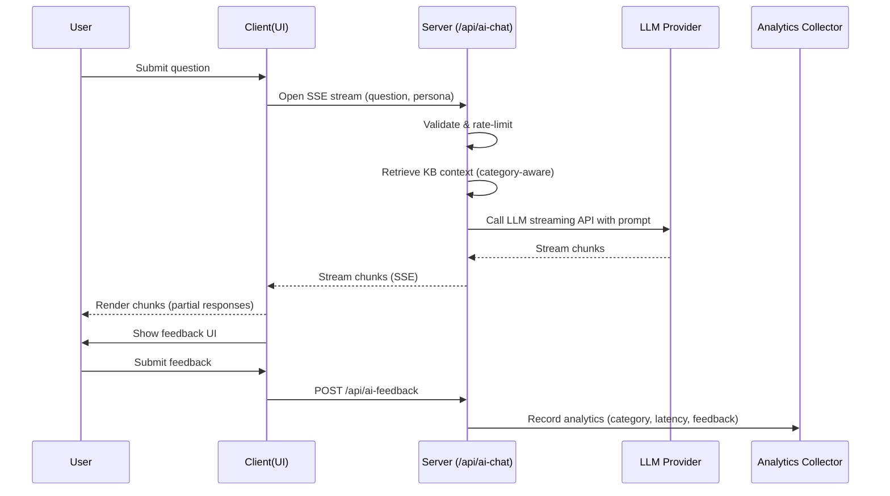

# AI Agency — v1.1 (2025-10-25)

Updated by Copilot Revision

## Overview — AI Recruiter Assistant
The AI Agency is upgraded to an "AI Recruiter Assistant" designed for recruiter workflows. It provides streamed, recruiter‑tone answers, question-category analytics, per-response feedback capture, and a smarter KB retrieval pipeline that prepares concise, fact‑backed answers from portfolio metadata.

## Key Features (v1.1)
- Streaming responses via Server-Sent Events (SSE) for immediate partial rendering
- Recruiter persona (professional, concise) via system prompt and response templates
- Dynamic KB retrieval with category-aware context (skills/projects/experience)
- Feedback capture (thumbs up/down) for each response + optional comment
- Analytics events for question category, response time, and feedback
- Graceful fallback + out-of-scope message templates when query is not in KB
- Rate limiting (10 req/hr per IP) and privacy-first operation (no PII storage)

## UX Flow (high level)
1. Visitor lands on `/ai-agency` and sees example questions and the chat interface.
2. Visitor clicks an example question or types a custom query and submits.
3. Client opens an SSE connection to `/api/ai-chat` requesting streaming output.
4. Server: validate -> rate-limit -> retrieve KB contexts -> call LLM streaming API -> forward chunks to client.
5. Client renders partial chunks as they arrive. When complete, the UI shows thumbs-up/down and an optional feedback comment box.
6. Analytics event recorded for question category and response latency; feedback events recorded when provided.

### UX Flow Diagram

## Fallback message examples (out-of-scope)
- "I don't have specific information about that in the portfolio. I can summarize related skills or projects if you'd like."
- "That question appears to be outside my knowledge base. Would you like me to suggest related areas (projects, skills, experiences)?"

## Developer Notes
- Use `lib/ai-context.ts` to produce category-aware prompt segments and short semantic summaries for retrieval.
- Prefer streaming-capable LLM API (OpenAI chat completions with streaming or similar).
- Keep conversation in-memory per session; do not persist messages or user identifiers.

*** End of AI Agency v1.1 ***